# Windows Active Directory Lab – DC01 & CLIENT01

This lab simulates a small company environment using **Windows Server** and **Active Directory Domain Services (AD DS)**.

I deployed:

- `DC01` – Windows Server Domain Controller for `lab.local`
- `CLIENT01` – Windows 10/11 client joined to the domain

---

## 1. Virtual Machines Overview

I created two virtual machines in VirtualBox:

- `DC01` – Windows Server (AD DS + DNS)
- `CLIENT01` – Windows 10/11 client

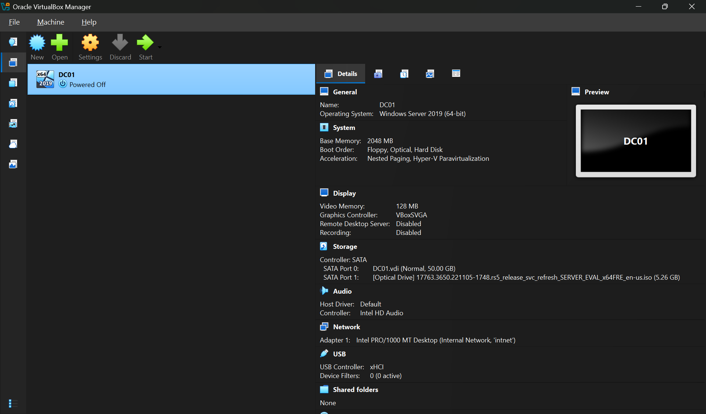
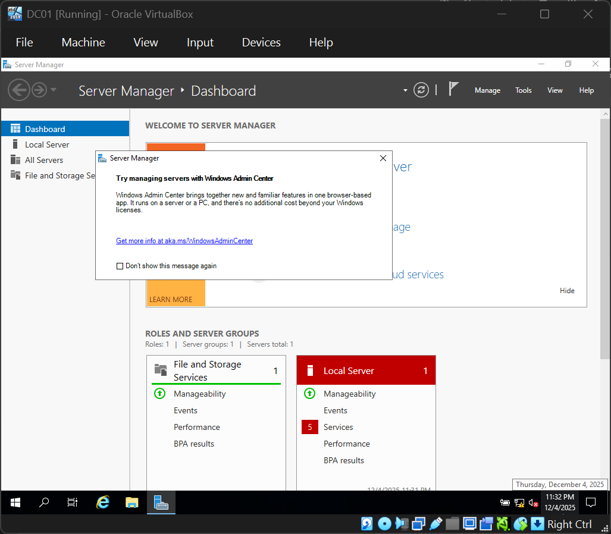

---

## 2. Configure DC01 – Hostname and Static IP

- Renamed the server to **DC01**
- Set static IP: `192.168.10.10`
- Subnet mask: `255.255.255.0`
- DNS: `127.0.0.1`

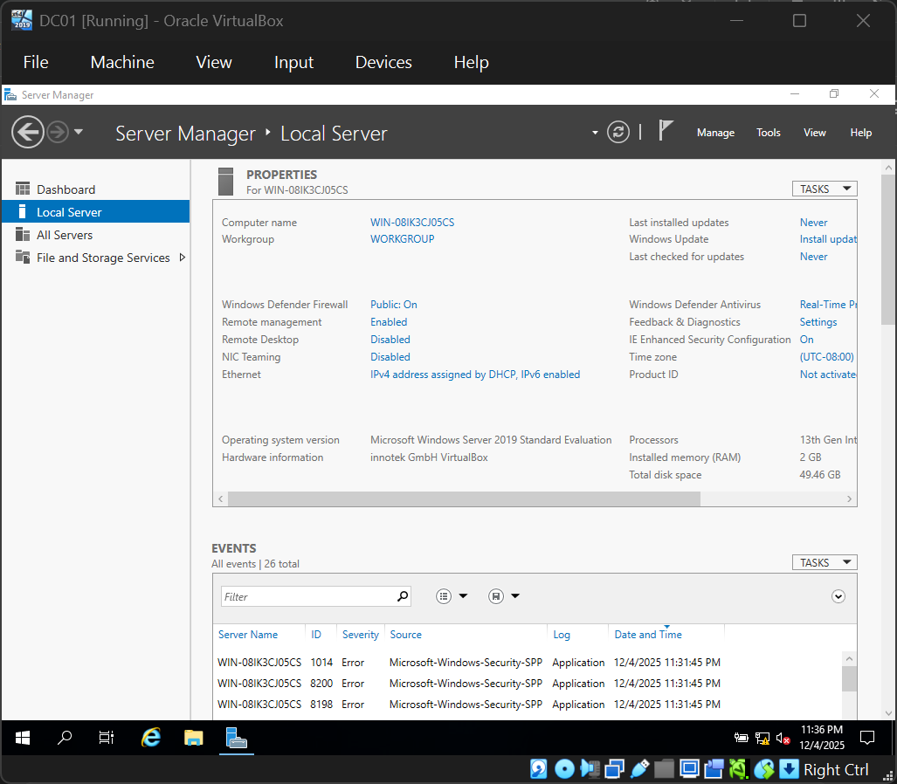
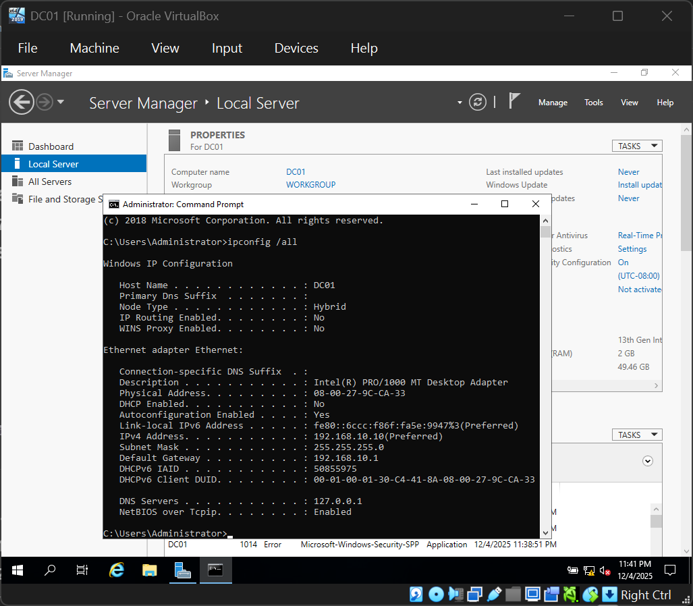

---

## 3. Install Active Directory Domain Services

Using **Server Manager**:

- Added the **Active Directory Domain Services (AD DS)** role  
- Promoted the server to a Domain Controller for the domain **`lab.local`**  

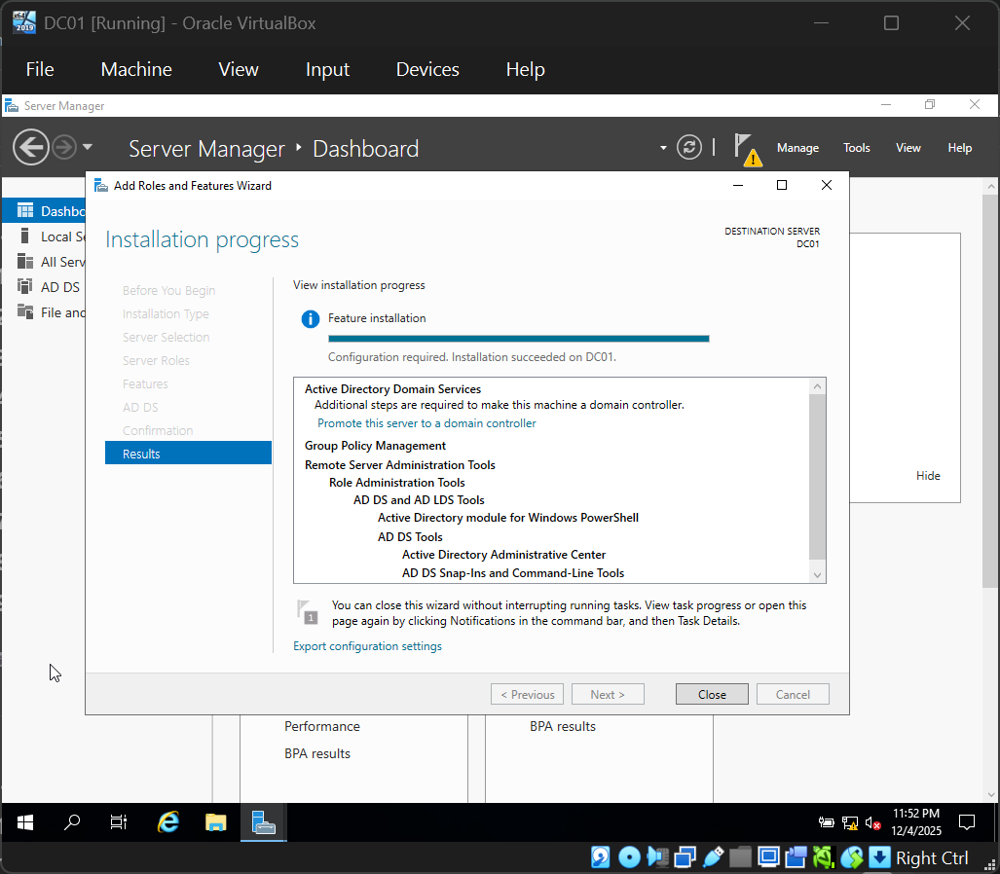

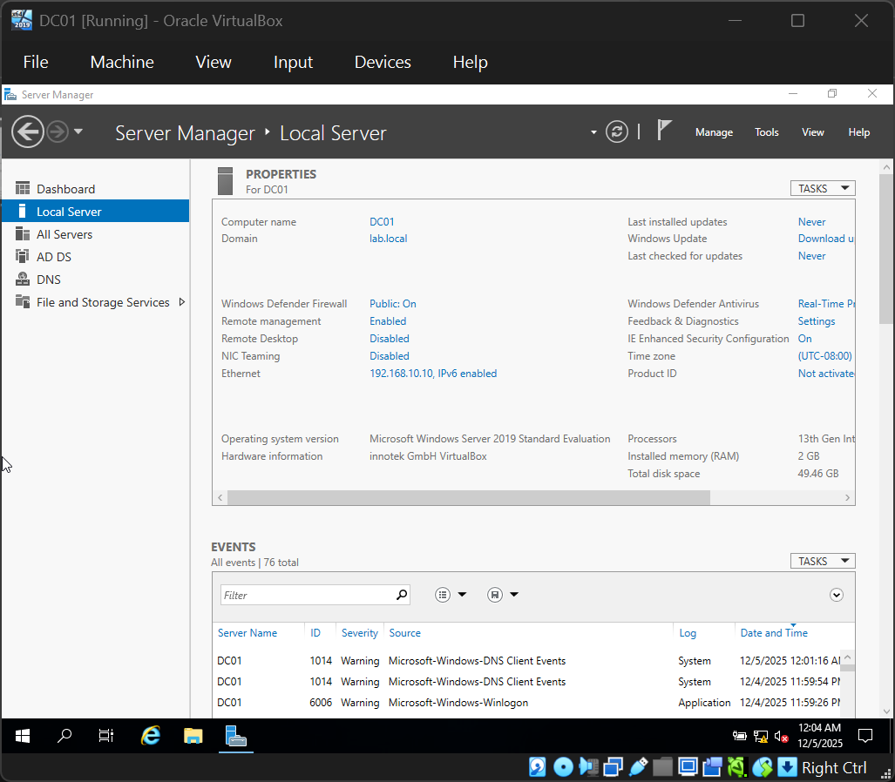

---

## 4. Create OUs and Users

In **Active Directory Users and Computers**, I created OUs:

- `IT`
- `HR`
- `Finance`

Then I created test users such as:

- `alice.admin` in **IT**
- `bob.hr` in **HR**
- `charlie.fin` in **Finance**

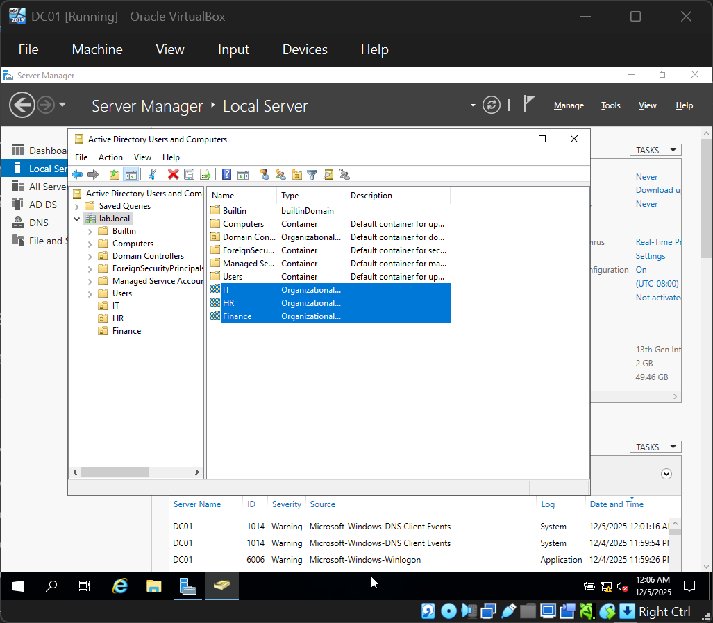
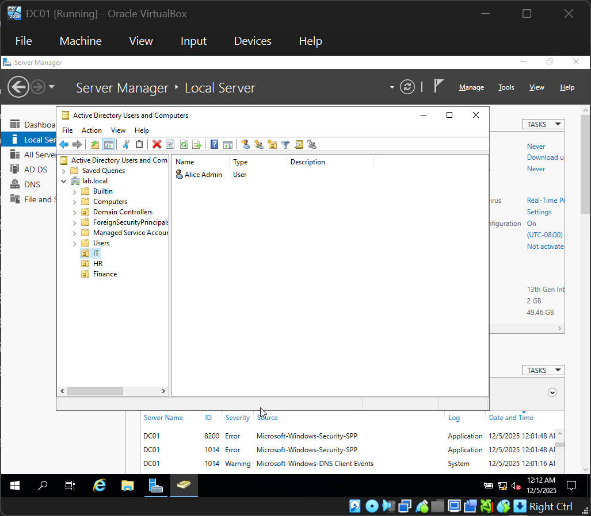

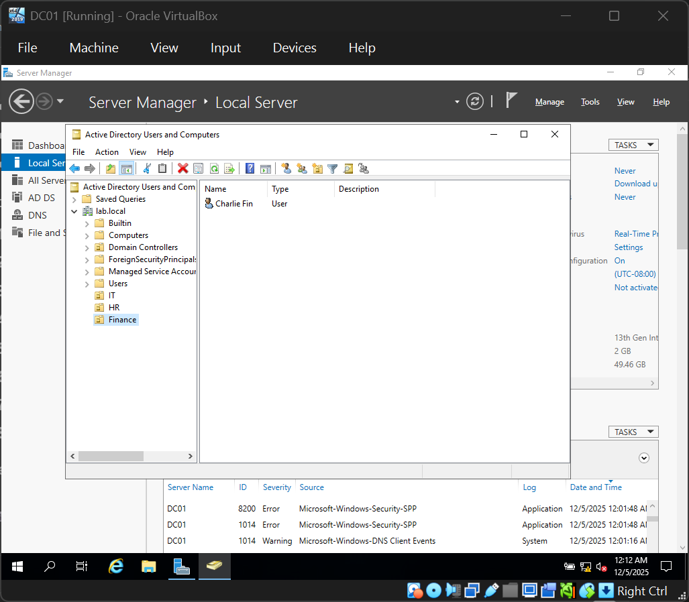

---

## 5. Configure CLIENT01 and Join Domain

On `CLIENT01`:

- Installed Windows 10/11
- Set IP: `192.168.10.20`
- DNS: `192.168.10.10` (DC01)

Then I joined the machine to the domain **`lab.local`** and received the message:

> Welcome to the LAB domain.

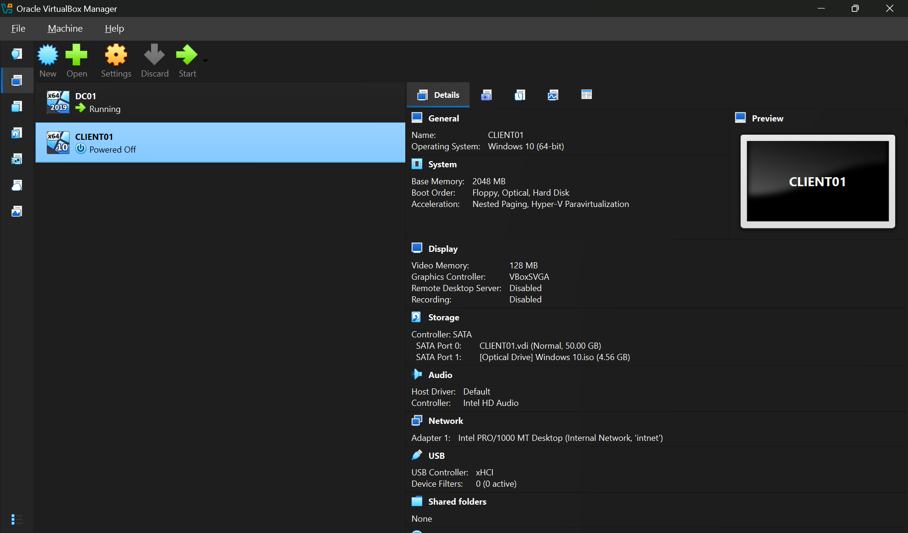
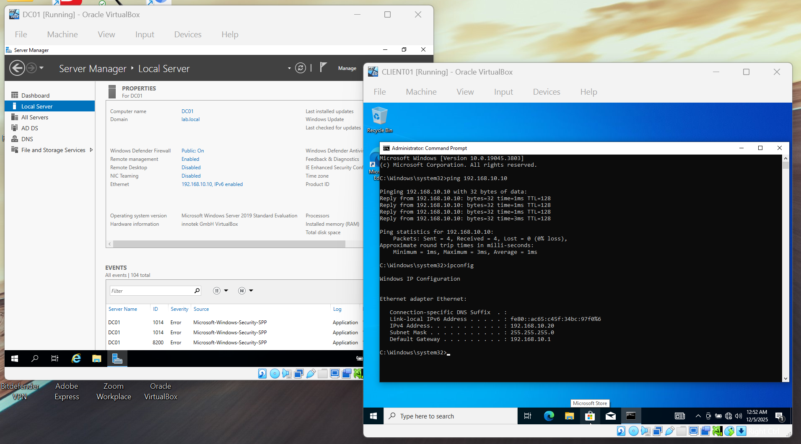
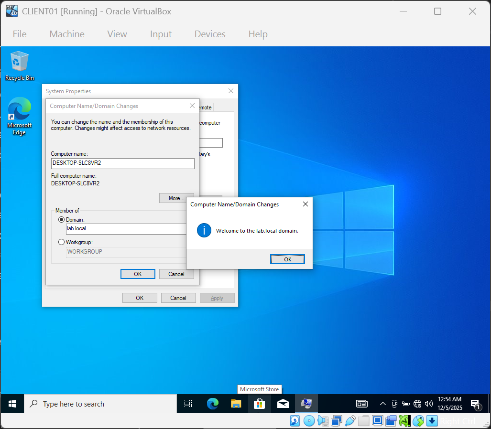

---

## 6. Log in as a Domain User

Finally, I logged into `CLIENT01` using the domain user:

- `LAB\alice.admin`

This confirmed that:

- Active Directory is functioning
- DNS is resolving the domain
- The client successfully joined **`lab.local`**

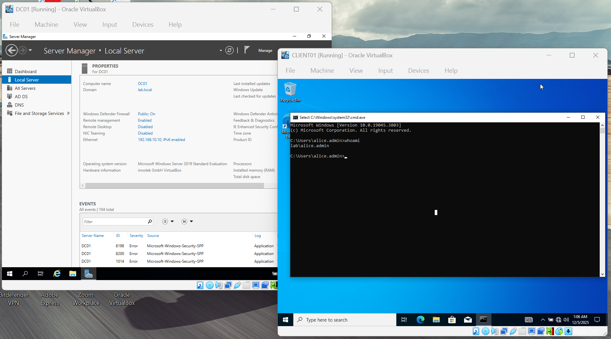

---

## 7. Skills Demonstrated

- Windows Server installation and configuration  
- Static IP and DNS setup  
- Installing and configuring **AD DS**  
- Creating OUs and domain users  
- Joining a Windows client to an AD domain  
